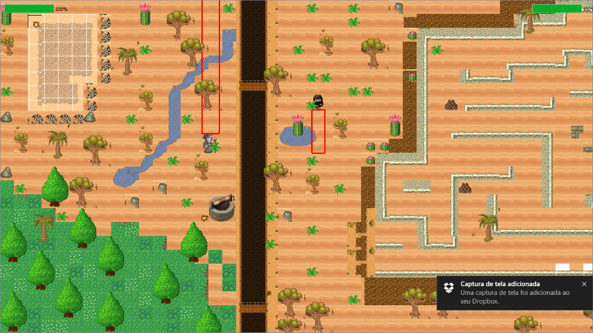
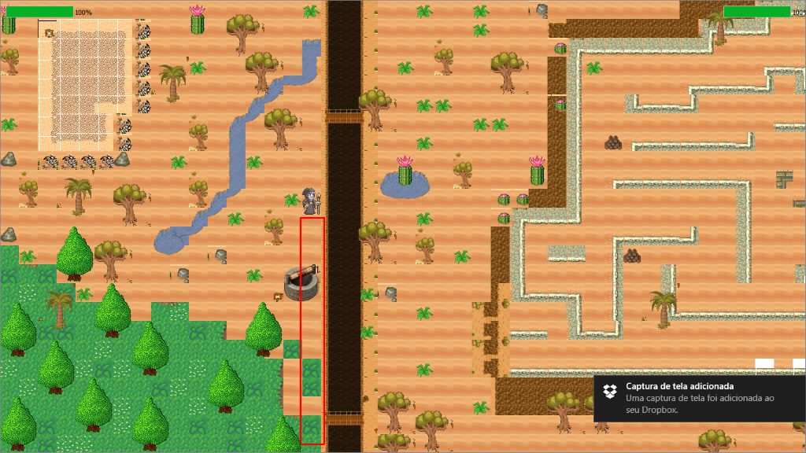
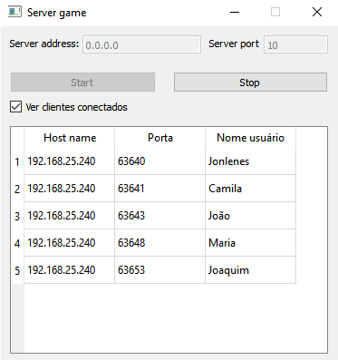
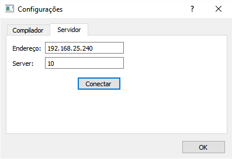

# 2dComilerGame
A two-player fighting game with compiler mode.

The first part of the game consists of a distributed server capable of managing thousands of users simultaneously, allowing any two players (Clients) to fight. A game always consists of two players who are connected in the same server. On the other hand, each game instantiates a Client, which performs all communication with the server. Special care was taken to ensure the synchronization of games.
The great differential of this game is in the compiler module of programming that has been added. With the knowledge of this secret programming language, the player is able to open a terminal in the middle of the game and improve its power, make a secret move and even hacker your opponent.
The game was developed in C ++ and Qt.

Link: https://github.com/Jonlenes/AirTravelSystem

  

  

  

  

  

  

